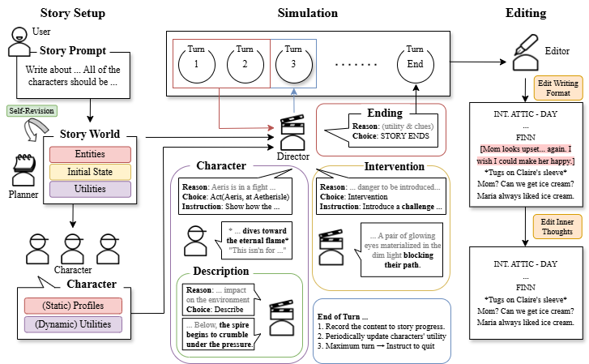

# CoDi: A Director-Actor Framework for Goal-Driven Interactive Story Generation with LLMs

**CoDi** adopts a director–actor paradigm to generate stories from user input through the collaboration of planner, character, director, and editor agents. The framework focused on empowering the control capabilities of the director agent. Our paper has been accepted by AIIDE 2025.



---

## 🚀 Setup

### Install Dependencies
```bash
pip install -r requirements.txt
```

### Configure API Keys
Set up your API keys in `./scripts/env.sh`:
```bash
export OPENAI_API_KEY="Your API Key"
export DEEPSEEK_API_KEY="Your API Key"
export GOOGLE_API_KEY="Your API Key"
```

---

## 📖 Generate a Story

Run CoDi with:
```bash
./scripts/generate.sh
```

---

## ✍️ Use Your Own Story Prompt

By default, CoDi uses the example prompt in `./data/example.jsonl`.  
You can customize this file to create your own stories. CoDi’s agents will automatically set the story world and simulate narratives based on your input.

Example format:
```jsonl
{"example_id": "story_id_1", "inputs": "Describe the story you want in natural language."}
{"example_id": "story_id_2", "inputs": "Another story prompt."}
```

---

## ⚙️ Arguments

You can configure `./scripts/generate.sh` with the following options:

- `--planner-agent-base-model`: Backbone LLM for the planner agent. *(default: gpt-4o-2024-11-20)*  
- `--director-agent-base-model`: Backbone LLM for the director agent. *(default: gemini-2.0-flash)*  
- `--character-agent-base-model`: Backbone LLM for the character agent. *(default: gemini-2.0-flash)*  
- `--editor-agent-base-model`: Backbone LLM for the editor agent. *(default: gemini-2.0-flash)*  
- `--plan-mode`: Enable predefined 4-part plot structure theory.
- `--act-seq-mode`: Convert story objectives into a sequence of acts. This produces a more detailed structure. *(Currently available only with plan mode; not included in the paper.)*
- `--reformat-novel`: Edit the simulated story into novel format. By default, a screenplay format is used.
- `--max-turn`: Maximum number of turns. CoDi automatically concludes the story when the number of turns exceeds this value. Increase the value for longer stories. *(default: 200)* 
- `--max-turn-part`: Available with plan-mode. Maximum number of turns per part. *(default: 200)* 
- `--max-turn-act`: Available with act-seq-mode. Maximum number of turns per act. *(default: 50)*
- `--setting-file`: Path to the data for using the same initial settings (Setup, Characters, Plan, The first turn of the story).
- `--load-file`: Path to the data to load. This option allows CoDi to resume without regenerating from the beginning even though the process is interrupted.

---

## 📚 Citation

*TBU*